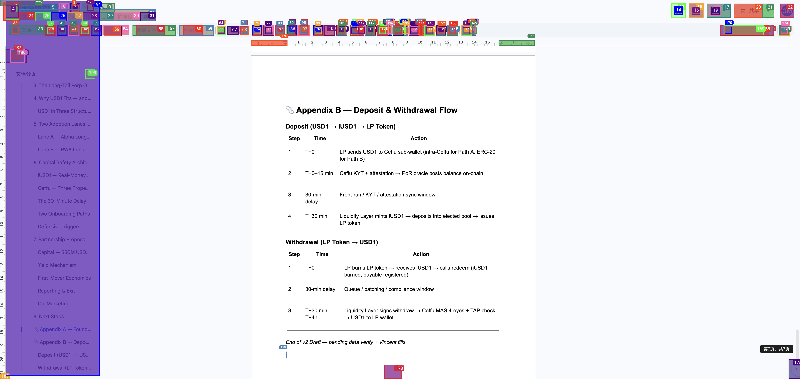

# livedocs-bridge

> **Live edit Google Docs from your LLM agent. No OAuth. No SaaS. Just CDP.**

Any MCP-compatible LLM client — Claude Desktop, Cursor, Cline, Continue, Windsurf — can
now edit the Google Doc that's already open in your Chrome. Same URL, same login,
nothing leaves your machine.



---

## Why

The existing options all force a trade-off. `livedocs-bridge` is the only one
that fills all four columns:

| Approach | Edits the same Doc? | Agent-driven? | No OAuth? | Fully local? |
| --- | :---: | :---: | :---: | :---: |
| Google Docs API `batchUpdate` | ✅ | ✅ | ❌ | ❌ |
| Glasp / Docs AI sidebar | ✅ | ❌ (chat only) | ✅ | ❌ |
| OAuth-based Google Docs MCP servers | ✅ | ✅ | ❌ | ❌ |
| Apps Script | ✅ (in-doc) | ❌ | ✅ | ✅ |
| Zapier / Make | ❌ (creates new) | ❌ | ❌ | ❌ |
| **livedocs-bridge** | **✅** | **✅** | **✅** | **✅** |

The wedge: *your* agent + *your* browser + *your* Doc, with nothing in the middle.

---

## How it works

```
LLM client (Claude Desktop / Cursor / Cline / ...)
    │  MCP stdio
    ▼
livedocs-bridge  ──── Playwright async API ────►  Chrome (CDP port 19825)
                                                       │
                                                       ▼
                                              Google Docs tab (already logged in)
```

We attach to your existing Chrome over the Chrome DevTools Protocol, dive into the
nested `iframe.docs-texteventtarget-iframe` that Docs actually listens to, and drive
the editor with frame-scoped keyboard / clipboard. No data leaves the machine.

---

## Install

```bash
pip install livedocs-bridge
# or, recommended:
uv pip install livedocs-bridge
```

You also need the Playwright runtime (one-time, ~200 MB):

```bash
python -m playwright install chromium
```

> You can skip the Playwright Chromium download if you only attach to an external
> Chrome (the CDP attach path doesn't launch a browser). It's installed by default
> because most setup guides assume it.

---

## Setup Chrome

You need a Chrome instance running with `--remote-debugging-port` and logged into
the Google account that owns the Doc.

**Option A — bb-browser (recommended):**

If you already use [bb-browser](https://github.com/your-org/bb-browser) for other
agent automation, it spawns a managed Chrome on port `19825` with a dedicated
profile. Nothing else to do.

**Option B — DIY:**

```bash
# macOS
"/Applications/Google Chrome.app/Contents/MacOS/Google Chrome" \
  --remote-debugging-port=19825 \
  --user-data-dir="$HOME/.livedocs-chrome-profile"

# Linux
google-chrome \
  --remote-debugging-port=19825 \
  --user-data-dir="$HOME/.livedocs-chrome-profile"

# Windows (PowerShell)
& "C:\Program Files\Google\Chrome\Application\chrome.exe" `
  --remote-debugging-port=19825 `
  --user-data-dir="$env:USERPROFILE\.livedocs-chrome-profile"
```

Log in to Google in that Chrome window once. The profile persists, so future runs
are silent.

---

## Wire into your MCP client

### Claude Desktop

`~/Library/Application Support/Claude/claude_desktop_config.json` (macOS) or
`%APPDATA%\Claude\claude_desktop_config.json` (Windows):

```json
{
  "mcpServers": {
    "livedocs-bridge": {
      "command": "livedocs-bridge",
      "env": { "LIVEDOCS_CDP_URL": "http://127.0.0.1:19825" }
    }
  }
}
```

### Cursor

`~/.cursor/mcp.json`:

```json
{
  "mcpServers": {
    "livedocs-bridge": {
      "command": "livedocs-bridge",
      "env": { "LIVEDOCS_CDP_URL": "http://127.0.0.1:19825" }
    }
  }
}
```

### Cline (VS Code)

`Cline > MCP Servers > Edit JSON`:

```json
{
  "mcpServers": {
    "livedocs-bridge": {
      "command": "livedocs-bridge",
      "env": { "LIVEDOCS_CDP_URL": "http://127.0.0.1:19825" },
      "autoApprove": ["docs_get_state", "docs_screenshot"]
    }
  }
}
```

Continue and Windsurf use the same MCP-stdio config shape — drop the same block
into their config file.

Full examples live in [`examples/`](examples/).

---

## Use

Open the Doc you want to edit in your CDP-attached Chrome, then in your LLM client:

> Open `https://docs.google.com/document/d/<id>/edit` and replace section 3,
> paragraph 2 with: "... new content ...".

The agent calls `docs_open` → `docs_find_replace`. The Doc updates in place. URL
unchanged. No browser tab popped, no permission prompt, no API key.

---

## Tools

| Name | Signature | Purpose |
| --- | --- | --- |
| `docs_open` | `(url: str)` | Open or focus a Doc tab. `docs.new` creates a fresh Doc. |
| `docs_replace_all` | `(content: str, content_type: 'markdown' \| 'html' = 'markdown')` | Wipe the Doc and inject new content. |
| `docs_append` | `(content: str, content_type = 'markdown')` | Append to the end of the Doc. |
| `docs_find_replace` | `(find: str, replace: str, all_occurrences: bool = True)` | Replace via the Docs Find & Replace dialog. |
| `docs_screenshot` | `(scroll_to: 'top' \| 'bottom' \| 'current' = 'top', path: str \| None = None)` | Capture viewport as PNG (path or base64). |
| `docs_get_state` | `()` | Doc URL, title, char count, observed-at timestamp. |

All tools return `{"success": bool, ...}` so MCP clients can branch on the result
instead of catching exceptions.

---

## Environment variables

| Name | Default | Notes |
| --- | --- | --- |
| `LIVEDOCS_CDP_URL` | `http://127.0.0.1:19825` | Chrome DevTools Protocol endpoint. |
| `LIVEDOCS_LOG_LEVEL` | `INFO` | Python log level (`DEBUG` for verbose). |
| `LIVEDOCS_LOG_FILE` | unset | If set, also write logs to this file. Stderr is always used. |

---

## Try it without an MCP client

```bash
python examples/quickstart.py
```

This replaces the body of whatever Google Doc is currently focused in your
CDP-attached Chrome with a sample memo. Useful to sanity-check the install.

---

## Limits & risks

- **DOM brittleness.** We depend on the class name `docs-texteventtarget-iframe`
  and `.kix-appview-editor`. If Google changes them, we update a selector.
- **Single-tab routing.** v0.1 talks to the first matching Doc tab. Multi-tab
  fan-out is a v0.2 feature.
- **ToS gray area.** Browser automation against Google Docs is not explicitly
  banned, but at very high frequencies it can trip anti-abuse heuristics. This
  is built for human-in-the-loop agent editing, not bulk farming.
- **Chrome dependency.** Must be running with `--remote-debugging-port` and
  logged in. The server doesn't launch or manage Chrome for you.

---

## Roadmap

- **v0.1** (now) — six core tools, Google Docs.
- **v0.2** — multi-tab routing; Google Sheets and Slides (same canvas + iframe
  architecture, different selectors).
- **v0.3** — Notion and Coda (different DOM, same CDP attach pattern).

---

## Contributing

Issues and PRs welcome. Run the test suite with:

```bash
pip install -e ".[dev]"
pytest -q
```

The tests are mock-based and don't require Chrome.

---

## License

[MIT](LICENSE) — © 2026 HertzFlow Contributors.

---

## Related reading

- Postmortem on why bb-browser MCP `browser_press` can't reach the Docs
  keystroke handler, and why Playwright CDP attach does:
  [docs/why-cdp-attach.md](docs/why-cdp-attach.md) *(coming with v0.2)*
